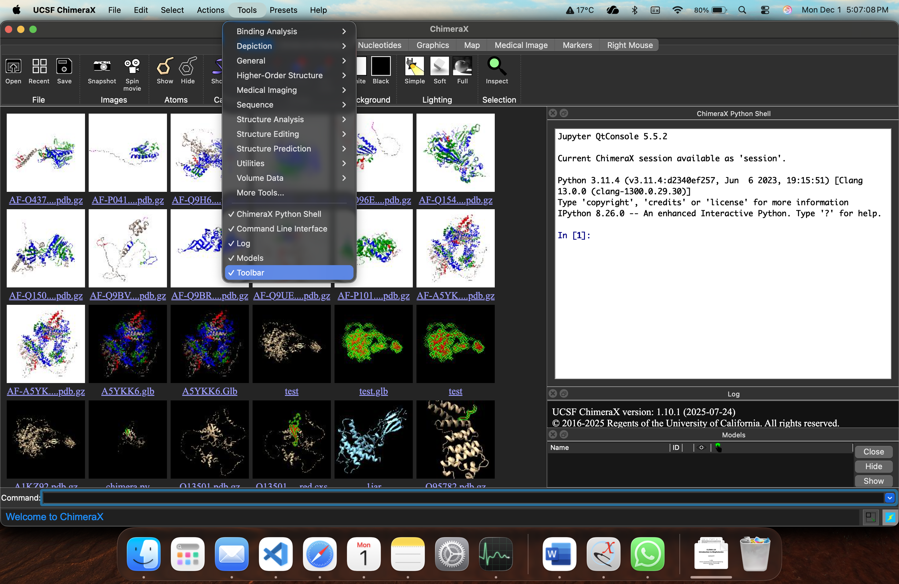

## Setting up ChimeraX

1. Download and install ChimeraX.
2. Open ChimeraX → **Tools** → **General** → **Shell**.  
   (You can drag the shell window to the right.)
3. *(Optional)* Go to **Tools** and uncheck:
   - Toolbars  
   - Model  
   - Command Line Interface  
   (These usually appear at the bottom.)



---

## First-Time Installation

1. Open the ChimeraX shell and paste:

```bash
pip install pandas ipython biopython matplotlib numpy
```

---

## Setting up the Code

We will be running code that processes a PDB file.  

The code is available on GitHub: [chimera_vis_script.py](https://github.com/pratiman-de/chimera-vis/blob/main/chimera_vis_script.py)

---

## Folder Structure

Ensure that the folders `2d_map/png`, `2d_map/pdb`, and `output_files` are located in the same directory as `chimera_vis_script.py`.

The folder structure should look like this:

```text
project_root/
├── chimera_vis_script.py
├── 2d_map/
│   ├── png/
│   └── pdb/
└── output_files/
    └── hits_with_uniprot_rpkm_aco.csv
```

---

## Setting the Working Directory

1. Copy the path of the `chimera_vis_script.py` (use **Command + Option + C**).

   Example:
```text
/Users/pde/Documents/chimera_vis/chimera_vis_script.py
```

2. Modify the path below and paste it into the ChimeraX shell.

```python
from chimerax.core.commands import run
run(session, 'runscript "/Users/pde/Documents/chimera_vis/chimera_vis_script.py"')
```

---